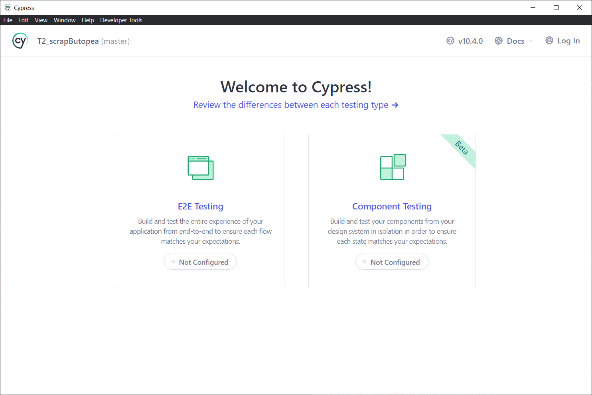
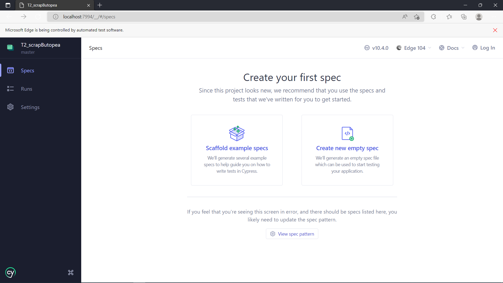
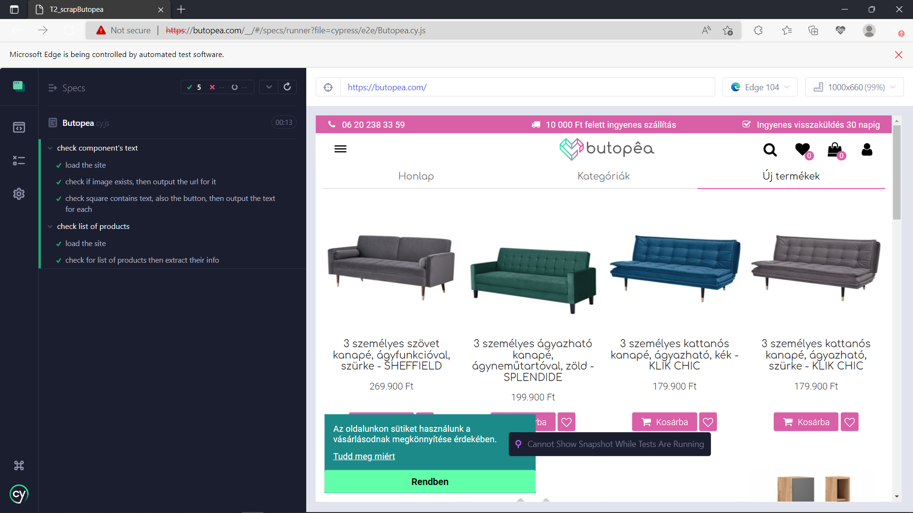
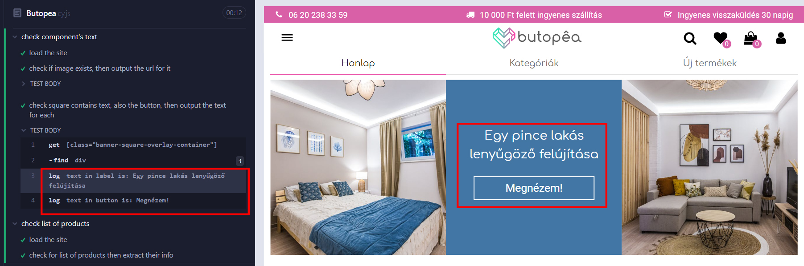
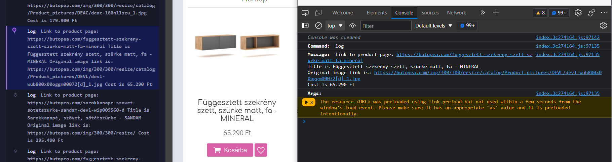

  <a href="#objective">Objective </a> •
  <a href="#run-it">Run it </a> •
  <a href="#working-steps">Working steps </a>

# Objective
Create a few tests for a popular end-to-end testing framework known as [Cypress](https://www.cypress.io/).Tests should load the website, perform some actions, check for existence of certain elements and extract data from the page. 

# Run it

1. For Cypress environment setup, you need to install [NodeJs](https://nodejs.org/en/download/)

2. Navigate to your folder of choice for working and run `npm init` to create `package.json`

3. install cypress in your project by `npm install cypress --save-dev`. It would show message to run the module using `− node_modules/.bin/cypress open` but it didn't work with me and i had to verify it first `npx cypress verify` then open `npx cypress open`.

4. This screen will show to you, choose "E2E testing" (note that it will take some time to load), then "Configuration Files" will be added to your project, after finishing the files, it will show to you which browser you want to test on, I went with Edge.

5. It will open new browser window that you can create new empty spec from, it will prompt a message to create file but will add examples along the file in the same folder `./cypress/e2e`

6. Move the `Butopea.cy.js` file to `./cypress/e2e` folder, then run it.

 As you can see on the left side, the test passed all the requirements.

Log requirement that is mentioned in test work case

(required from first screenshot with details)

(required from second screenshot with details)

# Working Steps
Getting to work with a site that have much divs in it, was a new approach for me, also having more than class name identifier and I wouldn't work with the whole class name, but only choose one unique in it, like trying to get the child element in the `cy.get('div[class*="product-listing"]'` while class tag itself have more than one. 

